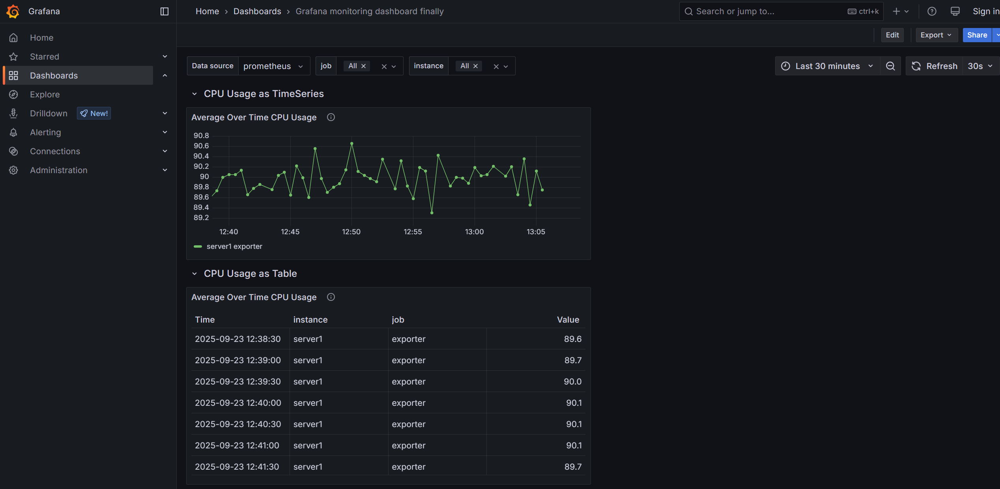

# Test Task: Monitoring CPU Usage

The task involves demonstrating the basic use of the Grafana Foundation SDK by creating and monitoring a Grafana dashboard.

## Create dashboard

As an example of Java code implementation I used the official GitHub repository [Grafana Foundation SDK](https://github.com/grafana/grafana-foundation-sdk). 
My project also uses the external package [`demo-prometheus-and-grafana-alerts`](demo-prometheus-and-grafana-alerts) which helps activate Docker containers (for Grafana, Prometheus, etc.) using Docker Compose [`docker-compose.yaml`](demo-prometheus-and-grafana-alerts/docker-compose.yaml).

#### Class `Main`:
Instead of manually clicking through the Grafana UI to build a dashboard, you use the Grafana Foundation SDK to create the dashboard's structure:
- **Dashboard metadata**: `title`, `uid`,`tags`,`refresh rate` and etc.
- **Panels**: Define the queries that will pull data from your Prometheus instance, such as `avg_over_time(cpu_usage)`. 
              It can be also configured how the data looks by choosing a visualization type, e.g. table, time series, etc.
- **Variables**: Define variables (like `prometheus`, `job` or `instance`) that allow to filter data on the fly.

Once the Java code defines the dashboard's structure, the program serializes that Java object into a JSON string and writes it to a file named [`dashboard.json`](src/main/resources/dashboard.json) into [`resources`](src/main/resources) directory.

#### Class `Common`: 
The common methods used to configure the default panel structure and activate Prometheus queries are located in [`Common.java`](src/main/java/monitoring/Common.java).

#### Class `Table`: 
Calculate an average time of CPU usage represented as a table panel using `tablePrometheusQuery(String query, String refId)` method.

#### Class `TimeSeries`: 
Calculate an average time of CPU usage represented as a time series panel `prometheusQuery(String query, String refId)` method.

**_Attention_**: A completed dashboard JSON file already exists. After making changes to the code (panels configuration, time refresh rate, etc.) please restart the  `Main` program.

## Monitoring dashboard

Set up a Grafana demo environment using the repository: https://github.com/grafana/demo-prometheus-and-grafana-alerts.

### Run the environment

This repository includes a [Docker Compose setup](./demo-prometheus-and-grafana-alerts/docker-compose.yaml) that runs Grafana, Prometheus, Prometheus Alertmanager, Loki, and an SMTP server for testing email notifications.

To run the demo environment:

```bash
docker compose up
```
You can then access:
- Grafana: [http://localhost:3000](http://localhost:3000/)
- Prometheus web UI: [http://localhost:9090](http://localhost:9090/) (not relevant)
- Alertmanager web UI: [http://localhost:9093](http://localhost:9093/) (not relevant)

Then open a new terminal window and enter the following command:

```
./run_http_requests.sh ./demo-prometheus-and-grafana-alerts/testdata/<test-file>.js
```

For `<test-file>`  write down the preferred file name. In our case [1.cpu-usage.js](./demo-prometheus-and-grafana-alerts/testdata/1.cpu-usage.js):
```bash
./run_http_requests.sh ./demo-prometheus-and-grafana-alerts/testdata/1.cpu-usage.js
```

The [`run_http_requests.sh`](run_http_requests.sh) script is a bash file that activates a simple method of simulating the sending of HTTP requests (multiple http://localhost:9090/api/v1/write) to Prometheus at an interval of 30–35 seconds. 
This helps to make the Grafana dashboard more interactive.

Final actions: 
- Copy the JSON string from [`dashboard.json`](src/main/resources/dashboard.json)
- Open http://localhost:3000 (Grafana)
- Create new dashboard
- Import JSON string in this dashboard

## Result

